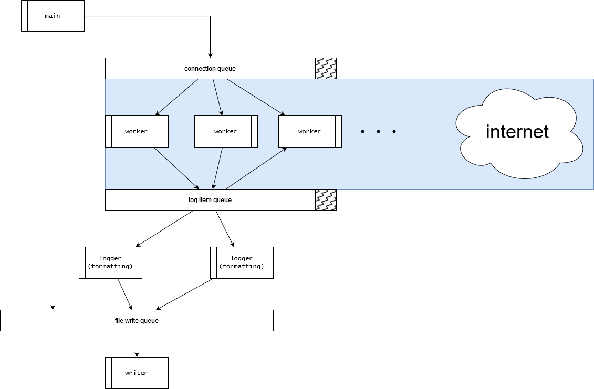

# Proxy server

## BigBoi

A simple doubling capacity rope structure for logging strings and appending to buffers

Features
- Extremely lightweight
- Safe abstraction over a simple large buffer (with no performance overhead)
- Great for concatenating multiple small items
- Automatic grows and cheap resests (resetting a string is 0 cost with no deallocs)

```c
BigBoi *BigBoi_new(const size_t initial_capacity);

size_t BigBoi_append_str(BigBoi *restrict const bigboi, char *restrict str);
size_t BigBoi_append_strn(BigBoi *restrict const bigboi, char *restrict str, size_t str_len);

char *BigBoi_to_str(BigBoi *restrict const bigboi);

void BigBoi_free(BigBoi *restrict const bigboi);

void BigBoi_reset(BigBoi *restrict const bigboi);

void BigBoi_debug_print(BigBoi *restrict const bigboi);
```

## SafeQueue

A thread-safe multi-producer multi-consumer queue 

Features:
- Multiple producer safe
- Multiple consumer safe
- Multiple exit modes (interrupt & wait until empty)
- Complete thread safety
- Supports producer interrupt
- Supports consumer interrupt

Limitations:
- When queue is full, insert order is not guaranteed

```c
SafeQueue SafeQueue_new(unsigned int capacity);
SafeQueue *SafeQueue_free(SafeQueue *sq);

void *SafeQueue_push(SafeQueue *sq, void *item);

void *SafeQueue_pop(SafeQueue *sq);
void **SafeQueue_exit(SafeQueue *sq, unsigned long int timeout_ns);

unsigned int _SafeQueue_length(SafeQueue *sq);

int SafeQueue_lock(SafeQueue *sq);
int SafeQueue_unlock(SafeQueue *sq);

void SafeQueue_Debug(SafeQueue *sq, pthread_mutex_t *stdout_mutex);

safequeue_status_t SafeQueue_exited(SafeQueue *sq);
```

## UrlBlacklist

Versitile blacklist inspired by glob

Features
- Run by a hashed set with dynamic size, using basic push cipher and linear congruential generator
- Whitelist capabilities by prefixing with `!` (if whitelisted, don't block)
- Match subset rules first e.g. `ww.google.com` -> `google.com`
- Match smaller rules first e.g. `google.com` -> `*.com`
- Match later segments first e.g. `google.com` -> `*.com` -> `google.*`
- Possible to match fragments e.g. `google.com` -> `*ogl*.*o*`
- Allow comments and empty lines (and lines leading with ips (although they aren't checked))
- Minimal memory usage (only memory used is table and the file memmapped)
- Optimized glob checking (no recursion)
- Return the rule that caused the block

```c
/**
 * Create a new UrlBlacklist
 *
 * @param filename The name of the file to read from
 * @param delim The delimiter character
 * @param table_size_2 The size of the table to use (2^table_size_2)
 *
 * 20 -> 1MB
 */
UrlBlacklist *UrlBlacklist_new(UrlBlacklist *cds, char *filename, const char delim, u_int8_t table_size_2);
void UrlBlacklist_free(UrlBlacklist *cds);

char *UrlBlacklist_exists(UrlBlacklist *cds, char *url);
char *UrlBlacklist_get_rule(UrlBlacklist *cds, char *url);
void UrlBlacklist_print_table(UrlBlacklist *bl);
```

# Structure



## Connection file descriptor queue

This is owned by the main thread and used to push file descriptors to be processed by the worker threads

## Worker threads

These threads are responsible for reading from the connection file descriptor queue and processing the requests.

They also check if the hostname is in the blacklist They process the file and requests logging to the logger worker thread

## Logging queue

Another queue for unprocessed logs. The logger worker thread reads from this queue and writes to the log file

## Logger worker threads

These threads are responsible for writing to the log file. but since the log file is a shared resource, it gets pushed into a file write queue.

## File write queue

This queue is used to write to the log file. The logger worker threads push the log file to this queue and the file writer thread reads from this queue and writes to the log file.


---

In summmary, there are 4 types of threads

- Main
- Worker
- Logger
- File writer

# Running

```sh
make proxy && ./a.out <port> # defaults to 26180
# debug version
make proxy-debug
# run valgrind
valgrind --leak-check=full\
  --show-leak-kinds=all\
  --track-origins=yes\
  --log-file=valgrind.log \
  ./a.out
```

> The program catches `^C` and will exit gracefully. Press `^C` twice to force exit

# Credits

[github.com/StevenBlack/hosts](https://github.com/StevenBlack/hosts)

for providing a large list of domains to block
